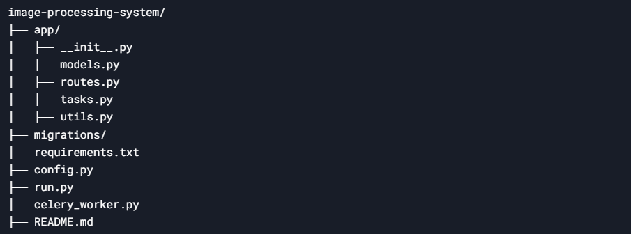

# image-processing-system

To solve this assignment, we need to build a system that efficiently processes image data from CSV files. The system will accept a CSV file, validate its format, asynchronously process the images (compressing them by 50%), store the processed images and associated product information in a database, and provide APIs for users to check the processing status. Below is a step-by-step guide to solving this assignment.

## Directory Structure



## Set Up the Project

1. Install Python
2. Create a virtual environment
    ```bash
       python -m venv venv
       source venv/bin/activate  # On Windows: venv\Scripts\activate
    ```
4. Install dependencies
    ```bash
       pip install flask celery sqlalchemy flask-sqlalchemy pillow requests redis
    ```
5. Start Redis:

      - Install Redis: https://redis.io/download
      
      - Run Redis: redis-server


## Run the Project

1. Run the Flask app:
    ```bash
       python run.py
    ```

2. Run the Celery worker:
    ```bash
       celery -A celery_worker.celery worker --loglevel=info
    ```
3. Test the APIs:

       - Use Postman or curl to test the /upload and /status endpoints.


## Test with Postman

1. Upload CSV:
  - Send a POST request to http://localhost:5000/upload with a CSV file.
  - Example CSV:


2. Check Status:
  - Send a GET request to http://localhost:5000/status?request_id=<request_id>

